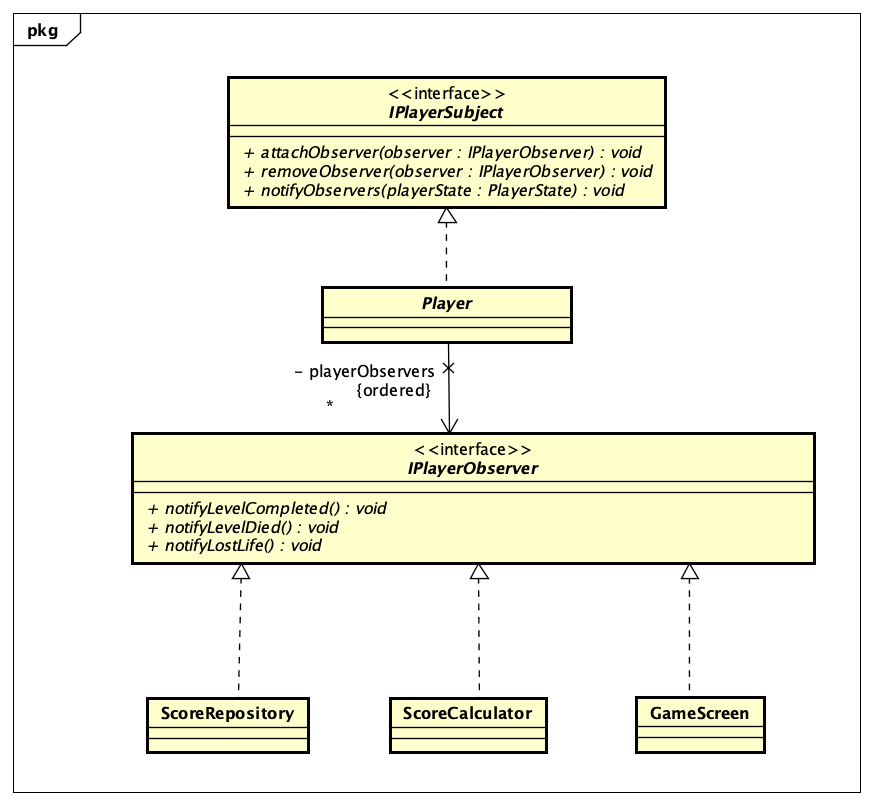
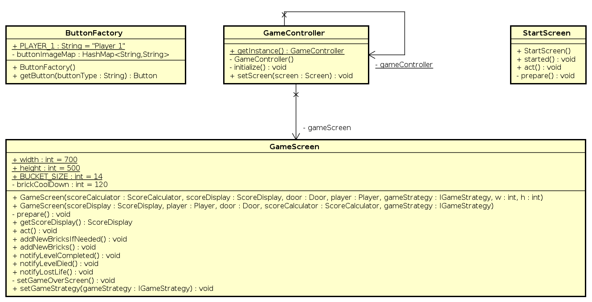

# Escape The Castle

### Team Members

- [Poonam Yadav](https://github.com/poonamyadav12) (015359305)
- [Alan Kuriakose](https://github.com/aln0071) (013854802)
- [Het Jagani](https://github.com/hetjagani) (015261415)
- [Mayank Garg](https://github.com/mayankgarg23) (015209948)

### Escape The Castle

### Individual Journal
- [Alan Kuriakose](individual_journals/alan_kuriakose.md)
- [Het Jagani](individual_journals/het_jagani.md)
- [Mayank Garg](individual_journals/mayank_garg.md)
- [Poonam Yadav](individual_journals/poonam_yadav.md)

### Summary of the Project
Our project uses [Greenfoot](https://www.greenfoot.org/home) integrated development environment to build [Escape The Castle](#escape-the-castle) `game from scratch`. We have taken inspiration from [Dungeon Escape](https://www.greenfoot.org/scenarios/12920).
This game is built in java. It consists of various design patterns that help in easy maintainability as well as extensibility for adding new features or modification is the game.

The game uses a Mario character who plays the game. Mario has to escape from the castle by avoiding bricks falling from the top and reaching the door as soon as possible.
Mario can move brick by pushing and arranging the fallen bricks to make a ladder to reach the door. The score is calculated using a [score calculator](escapethecastle/ScoreCalculator.java), which uses a `score factor`.
The score is inversely proportional to the number of bricks fallen. If Mario uses a lot of bricks to reach the door, the score will be less.

The game provides three levels of play
* Easy  
  Only one brick falls at a time, and the player gets two lives. The scoring factor is less as well.
* Medium  
  Two bricks fall simultaneously, and the player gets three lives. The scoring factor is higher than the easy level.
* Hard  
  Three bricks fall simultaneously, and the player gets four lives. The scoring factor is the highest of all levels.

### Key features of the Game
- The game [start screen](#start-screen) allows the player to choose any of the three different avatars such as Mario, Wario, and Luigi. It also allows the player to choose the levels such as Easy, Medium, or Hard.
- After selecting the avatar and level, the player can start playing the game using the start button on the game start screen. Based on the level selected the game uses strategy to change the brick falling speed, player lives, etc. The score is updated on the score display consistently.
- If the player reaches the door the [game over screen](#scoreboard-winning-page) is displayed with a congratulation message which shows the player's total score and current rank.
- If the player dies in between the game if the brick hits the head, the [game over screen](#scoreboard-loosing-page) with a loose message which shows the player's total score and current rank.

#### Start Screen

#### Game Screen

#### ScoreBoard Winning Page

#### ScoreBoard Loosing Page

## Design Overview

### High Level Architecture Diagram

### Architecture Diagram

All main components and interactions between components are shown below. Eight design pattern are implemented (Composite, Command, Strategy, Decorator, State, Observer, Factory Method, Singleton).

## Key Design Features:

### Composite Pattern

Composite pattern is used to display components on screen. Here the Display Component extends Actor and maintains list of sub components inside it. It renders all the components added as its child at location of that child component into the screen which is passed to render(). Here Screen extends the World class and has one or many display components.

### Command Pattern

Command Pattern is used to add action listener to anyh button that is present in the game. Here the Button class implements the IInvoker interface so that when invoke() is called the button performs some action added in the command that is attached to the button. Here we are creating buttons from ButtonFactory which adds inline receiver to Command and attaches the command to created Button.

### Strategy Pattern

Strategy Pattern is used to configure the game to start at different levels - Easy, Medium and Hard level.
EasyGameStrategy, MediumGameStrategy and HardGameStrategy implements respective algorithm for the game levels.
GameStrategyButton helps to add different buttons for Easy, Medium and Hard level. Strategy Pattern helps us to keep
code structure clear and flexible for adding any more game levels.

### Decorator Pattern

Decorator Pattern allows us to add responsibilites to individual objects and not to all objects (i.e. entire class).

#### PlayerOption Decorator Pattern

Add responsibility to Player object dynamically and transparently for characters among Mario, Wario and Luigi.

### State Pattern

State pattern allows an object to alter its behavior when its internal state changes.

#### Screen state machine

##### Screen State class diagram
- [GameController](escapethecastle/GameController.java) class controls the screens displayed in the game. 
- [StartScreen](escapethecastle/StartScreen.java), [GameScreen](escapethecastle/GameScreen.java) and [GameOverScreen](escapethecastle/GameOverScreen.java) are the three states of the screens. 
- Based on the action performed by the player the transition between the three screens is managed by the [GameController](escapethecastle/GameController.java).

#### Player state machine
- [Player](escapethecastle/Player.java) has three [PlayerStates](escapethecastle/PlayerState.java) i.e. [WonState](escapethecastle/WonState.java), [NotPlaying](escapethecastle/NotPlayingState.java), [Playing](escapethecastle/PlayingState.java) and [DiedState](escapethecastle/DiedState.java). 
- Based on the PlayerState the behaviour of the [Player](escapethecastle/Player.java) is maintained.

##### Player State Class diagram

### Observer Pattern

Observer pattern is a software design pattern in which an object, named the subject, maintains a list of its dependents, called observers, and notifies them automatically of any state changes, usually by calling one of their methods.

#### Player observer pattern
- [Player](escapethecastle/Player.java) has three observers i.e. [ScoreRepository](escapethecastle/ScoreRepository.java), [GameScreen](escapethecastle/GameScreen.java) and [ScoreCalculator](escapethecastle/ScoreCalculator.java). 
- Based on the [PlayerState](escapethecastle/PlayerState.java) Player calls the different notify method i.e. `notifyLevelCompleted()`, `notifyLevelDied()` and `notifyLostLife()` of the attached observers.

#### Brick observer pattern
[Brick](escapethecastle/Brick.java) has [ScoreCalculator](escapethecastle/ScoreCalculator.java) as observer. It notifies the [ScoreCalculator](escapethecastle/ScoreCalculator.java) using `notifyBrickFall()` method to calculate the score once the brick touches the ground.

#### Score update observer pattern
[ScoreCalculator](escapethecastle/ScoreCalculator.java) has [ScoreDisplay](escapethecastle/ScoreDisplay.java) as observer. After calculating the score it notifies the ScoreDisplay using `updateScore()` method. 

### Factory Pattern

#### Player Factory

The factory pattern is used to create the `Player` objects for the three characters - `Mario`,  `Wario`, and `Lugi`.

#### Button Factory

The factory pattern is used to create different `Button` objects for the game including the `start` button, `quit`
button, and `replay` button.

### Singleton Pattern

#### Game Controller

The singleton pattern is used for the `GameController`. It has a static `gameController` instance which is returned on
calling the `getInstance()` method. The `StartScreen`, `ButtonFactory`, and `GameScreen` uses it to change the current
game screen.

#### Game Strategy Provider

The `GameStrategyProvider` uses the singleton pattern and stores the current strategy being used. It is used by other
classes like `GameController`, `GameOverScreen`, `GameScreen`, `GameStrategyButton`, `ScoreCalculator`,
and `ScoreRepository` for getting and setting the game strategy.

#### Player Selector

The `PlayerSelector` uses the singleton pattern. It allow setting and getting the playable character that is to be used
for the current game. It is used by classes like the `GameController` and `StartScreen`.

### [Daily Standup Video](https://youtu.be/WXwPdFy2Z7s)

### Burndown Chart

### Sprint Task Sheet

### [Project Task Board](https://github.com/nguyensjsu/fa21-202-backend-beasts/projects/1)

### Areas of Contribution

- **Poonam Yadav**
  - Strategy pattern for selecting the game level
  - State pattern for managing the player lives 
  - State pattern for managing the screens of the game
  - Decorator pattern for decorating the player with an option of changing the avatar on the start screen
  - Decorator pattern for showing the player lives at the game screen
  - Observer pattern for score calculation 
  - Singleton pattern for providing the game strategy and chosen player

- **Mayank Garg**
    - Factory Method Pattern for creating Players
    - Observer Pattern for displaying score on the screen
    - Observer Pattern for bricks for score calculation
    - Created Game Over Screen using composite pattern
    - Architecture Diagram
    - Documentation and Class Diagram

- **Alan Kuriakose**
    - Factory Method Pattern for creating Buttons
    - Command pattern for game start screen
    - Sounds for the game
    - Animation of player
    - Video for game trailer
    - Documentation and Class Diagram
