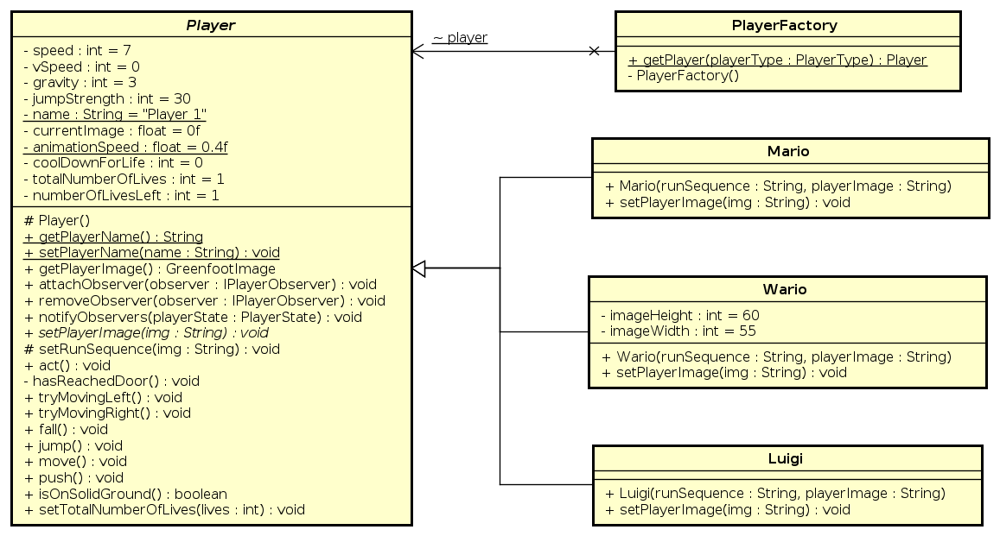
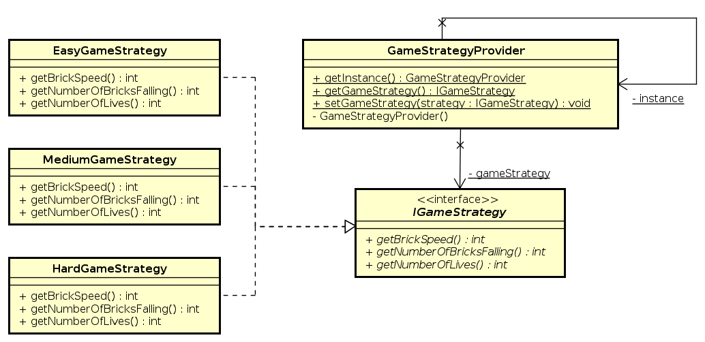

# Backend Beasts

### Team Members

- [Poonam Yadav](https://github.com/poonamyadav12) (015359305)
- [Alan Kuriakose](https://github.com/aln0071) (013854802)
- [Het Jagani](https://github.com/hetjagani) (015261415)
- [Mayank Garg](https://github.com/mayankgarg23) (015209948)

### Escape The Castle

**Start Screen**

**Game Screen**

**ScoreBoard Winning Page**

**ScoreBoard Loosing Page**

## Key Design Features:

### Composite Pattern
Composite pattern is used to display components on screen. Here the Display Component extends Actor and maintains list of sub components inside it. It renders all the components added as its child at location of that child component into the screen which is passed to render(). Here Screen extends the World class and has one or many display components.

### Command Pattern
Command Pattern is used to add action listener to anyh button that is present in the game. Here the Button class implements the IInvoker interface so that when invoke() is called the button performs some action added in the command that is attached to the button. Here we are creating buttons from ButtonFactory which adds inline receiver to Command and attaches the command to created Button.

### Strategy Pattern

Strategy Pattern is used to configure the game to start at different levels - Easy, Medium and Hard level.
EasyGameStrategy, MediumGameStrategy and HardGameStrategy implements respective algorithm for the game levels.
GameStrategyButton helps to add different buttons for Easy, Medium and Hard level. Strategy Pattern helps us to keep
code structure clear and flexible for adding any more game levels.

### Decorator Pattern

Decorator Pattern allows us to add responsibilites to individual objects and not to all objects (i.e. entire class).

#### PlayerOption Decorator Pattern

Add responsibility to Player object dynamically and transparently for characters among Mario, Wario and Luigi.

### State Pattern

State pattern allows an object to alter its behavior when its internal state changes.

#### Screen state machine

##### Screen State class diagram

#### Player state machine

##### Player State Class diagram

### Observer Pattern

Observer pattern is a software design pattern in which an object, named the subject, maintains a list of its dependents, called observers, and notifies them automatically of any state changes, usually by calling one of their methods.

#### Player observer pattern
- [Player](escapethecastle/Player.java) has three observers i.e. [ScoreRepository](escapethecastle/ScoreRepository.java), [GameScreen](escapethecastle/GameScreen.java) and [ScoreCalculator](escapethecastle/ScoreCalculator.java). 
- Based on the [PlayerState](escapethecastle/PlayerState.java) Player calls the different notify method i.e. `notifyLevelCompleted()`, `notifyLevelDied()` and `notifyLostLife()` of the attached observers.

#### Brick observer pattern
[Brick](escapethecastle/Brick.java) has [ScoreCalculator](escapethecastle/ScoreCalculator.java) as observer. It notifies the [ScoreCalculator](escapethecastle/ScoreCalculator.java) using `notifyBrickFall()` method to calculate the score once the brick touches the ground.

#### Score update observer pattern
[ScoreCalculator](escapethecastle/ScoreCalculator.java) has [ScoreDisplay](escapethecastle/ScoreDisplay.java) as observer. After calculating the score it notifies the ScoreDisplay using `updateScore()` method. 

### Factory Pattern

#### Player Factory

The factory pattern is used to create the `Player` objects for the three characters - `Mario`,  `Wario`, and `Lugi`.

#### Button Factory

The factory pattern is used to create different `Button` objects for the game including the `start` button, `quit`
button, and `replay` button.

### Singleton Pattern

#### Game Controller

The singleton pattern is used for the `GameController`. It has a static `gameController` instance which is returned on
calling the `getInstance()` method. The `StartScreen`, `ButtonFactory`, and `GameScreen` uses it to change the current
game screen.

#### Game Strategy Provider

The `GameStrategyProvider` uses the singleton pattern and stores the current strategy being used. It is used by other
classes like `GameController`, `GameOverScreen`, `GameScreen`, `GameStrategyButton`, `ScoreCalculator`,
and `ScoreRepository` for getting and setting the game strategy.

#### Player Selector

The `PlayerSelector` uses the singleton pattern. It allow setting and getting the playable character that is to be used
for the current game. It is used by classes like the `GameController` and `StartScreen`.

